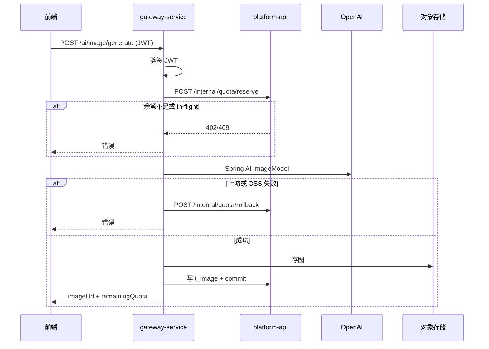

# 实施计划：AI 图像生成平台

**分支**：`001-ai-image-platform` | **日期**：2026-05-27 | **规格**：[spec.md](./spec.md)

**输入**：来自 `specs/001-ai-image-platform/spec.md` 的功能规格（含 2026-05-27 澄清会话）

## 概要

建设 B2C Web 平台：Vue 2 前端 + **platform-api**（业务域、JPA、支付、模版、管理）+ **gateway-service**（WebFlux、Spring AI、生图/对话透传、配额协调）。默认图像模型 `gpt-image-2`；次数采用 **先预扣、成功 commit、失败 rollback**；支付仅 **微信 Native 扫码**，订单 **15 分钟**超时；每用户 **单路** 生图并发。

## 技术上下文

| 项 | 选型 |
|----|------|
| **语言/版本** | Java 21 |
| **主要依赖** | Spring Boot 3.3.x、Spring WebFlux（网关）、Spring MVC + Spring Data JPA（平台）、Spring AI、Spring Security + JWT、Vue 2 + Element UI + Vuex |
| **存储** | MySQL 8（业务权威）、Redis 7（验证码、Token、in-flight 锁）、MinIO/OSS（图片） |
| **测试** | JUnit 5、Spring Boot Test、WebTestClient、WireMock、Testcontainers（MySQL/Redis） |
| **目标平台** | Linux 容器（Docker）；Web PC + 移动自适应 |
| **项目类型** | Web 应用（前后端分离 + AI 网关） |
| **性能目标** | 常规 API P95 &lt; 500ms；生图 P95 &lt; 15s；≥1000 并发活跃用户（见 spec FR-034–036） |
| **约束** | 宪章：网关非阻塞透传；密钥仅服务端；公开路由需契约/集成测试 |
| **规模/范围** | v1 约 12 周里程碑；7 个用户故事；不含图生图/JSAPI/H5 |

## 宪章检查

*门禁：Phase 0 研究前 ✅ | Phase 1 设计后 ✅*

| 原则 | 状态 | 说明 |
|------|------|------|
| I. Spring AI 优先 | ✅ | 对话 ChatModel；生图 `RelayImageClient` 调 OpenAI 兼容中继（见 research §2 例外说明） |
| II. WebFlux 透传网关 | ✅ | AI 路由仅在 `gateway-service`；JPA/支付/审核在 `platform-api` |
| III. 规格优先增量交付 | ✅ | spec 含 P1–P3 用户故事与澄清；M1 可独立验收 P1 |
| IV. 契约与集成验证 | ✅ | `contracts/openapi.yaml` + quickstart 冒烟/契约测试清单 |
| V. 密钥与客户端边界 | ✅ | OpenAI/微信密钥仅后端；JWT 不含上游 Key |
| VI. 最小范围与可观测 | ✅ | 双服务为宪章必要拆分；结构化日志 + `X-Request-Id` |

**Phase 1 后复核**：`data-model.md` 与内部配额 API 不将领域逻辑塞入网关；网关仅编排鉴权→reserve→AI→存储→commit/rollback。

## 项目结构

### 文档（当前功能）

```text
specs/001-ai-image-platform/
├── plan.md              # 本文件
├── research.md          # Phase 0
├── data-model.md        # Phase 1
├── quickstart.md        # Phase 1
├── contracts/           # Phase 1
│   ├── openapi.yaml
│   └── README.md
├── spec.md
└── tasks.md             # /speckit-tasks 生成
```

### 源代码（将创建）

```text
backend/
├── gateway-service/          # WebFlux, Spring AI, 无 JPA
│   ├── src/main/java/.../api/      # ImageGatewayController, ChatGatewayController
│   ├── src/main/java/.../client/   # QuotaClient, PlatformApiClient, OssClient
│   └── src/test/.../contract/
├── platform-api/             # MVC, JPA, 支付, 模版, 管理
│   ├── src/main/java/.../domain/
│   ├── src/main/java/.../api/
│   ├── src/main/resources/db/migration/
│   └── src/test/.../contract/
└── pom.xml                   # 父 POM（可选）

frontend/
└── web/                      # Vue 2 + Element UI
    ├── src/views/            # 聊天、广场、充值、管理
    ├── src/store/
    └── src/api/

deploy/
├── docker-compose.dev.yml
└── nginx/nginx.conf

tests/
└── e2e/                      # 可选 Playwright 冒烟
```

**结构决策**：选用 **选项 2（Web 应用）** 并拆 **gateway + platform** 以满足宪章 II；网关不引入 JPA。

## 复杂度跟踪

| 违规项 | 为什么需要 | 为什么拒绝更简单方案 |
|--------|------------|----------------------|
| 双服务部署 | 宪章要求 WebFlux 轻量网关 vs 阻塞式 JPA 业务 | 单体无法同时满足非阻塞 AI 透传与丰富领域逻辑而不混层 |
| JPA + MySQL（platform-api） | 用户/订单/模版/流水持久化为规格必需 | 宪章「网关默认无存储」；持久化不能放在网关 |
| 内部配额 API | 网关需预扣/回滚且权威在 DB | 网关直连 DB 破坏边界与事务一致性 |
| Spring AI 流式 SSE（潜在） | 若 ChatModel 流式 API 不足，在 `client` 层用 WebClient 适配 | 记录在案，限定适配层，不扩散到业务模块 |

## Phase 0：研究与决策

详见 [research.md](./research.md)。所有技术上下文项已解析，无未决 `NEEDS CLARIFICATION`。

## Phase 1：设计与契约

| 产物 | 路径 |
|------|------|
| 数据模型 | [data-model.md](./data-model.md) |
| API 契约 | [contracts/openapi.yaml](./contracts/openapi.yaml) |
| 本地启动 | [quickstart.md](./quickstart.md) |

### 核心流程（生图）



### 实施分阶段（对应 spec 里程碑）

| 阶段 | 周期 | 交付 |
|------|------|------|
| M1 | W1–2 | 仓库骨架、Flyway、认证、配额、网关对话/生图、Vue 壳 |
| M2 | W3–5 | 会话/图库、邀请、次数流水 |
| M3 | W6–7 | 模版广场、AI+人工审核 |
| M4 | W8 | Native 支付、订单超时任务 |
| M5 | W9–10 | 管理端、报表、系统配置 |
| M6 | W11–12 | 联调、压测、上线 |

## Phase 2 说明

**`/speckit-plan` 止于 Phase 1 设计产物**；任务分解由 **`/speckit-tasks`** 生成 `tasks.md`（按用户故事分组，含契约测试任务）。

## 测试与质量门禁

- 每个公开路由至少 1 条契约或集成测试（成功 + 主要失败码）。
- 网关必测：401、402、409、上游超时 rollback、日志无 Key 泄漏。
- 支付必测：验签、幂等回调、15 分钟取消后回调不入账。
- P1 完成标准：满足 spec **SC-001、SC-002** 与 quickstart 第 6 节。
